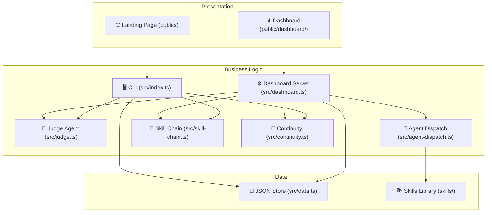

# Codebase Analysis

> **Quick Reference**
> - **Project**: Cody Master v3.2.0
> - **Type**: CLI Tool + Express Dashboard + Skills Framework
> - **Languages**: TypeScript, HTML, CSS, JavaScript
> - **Frameworks**: Commander.js (CLI), Express.js (Dashboard)
> - **Lines of Code**: ~4,500+ (core TypeScript)

## Architecture Overview



*Three-layer architecture: Presentation (landing page + dashboard), Business Logic (CLI + REST API + Judge), Data (JSON file store + skills library).*

## Directory Structure

```
cody-master/
├── src/                    # Core TypeScript source
│   ├── index.ts            # CLI entry point (1536 lines)
│   ├── dashboard.ts        # Express REST server (710 lines)
│   ├── continuity.ts       # Working memory system
│   ├── judge.ts            # Judge Agent evaluation
│   ├── skill-chain.ts      # Multi-skill pipeline engine
│   ├── agent-dispatch.ts   # Task → AI Agent dispatch
│   ├── data.ts             # JSON data store
│   └── chains/             # Chain definitions
├── public/                 # Landing page website
│   ├── index.html          # Main landing page
│   ├── skills.html         # Skills catalog
│   ├── story.html          # Origin story
│   ├── demo.html           # Demo page
│   ├── start.html          # Getting started
│   ├── persona.html        # Persona detail pages
│   ├── dashboard/          # Dashboard SPA
│   ├── css/                # Stylesheets
│   ├── js/                 # Client-side JavaScript
│   ├── i18n/               # Translation files (6 languages)
│   └── img/                # Assets
├── skills/                 # 30+ AI Agent Skills
│   ├── cm-tdd/             # Test-Driven Development
│   ├── cm-debugging/       # Root cause investigation
│   ├── cm-planning/        # Implementation planning
│   ├── cm-execution/       # Autonomous execution
│   └── ...                 # 25+ more skills
├── adapters/               # Platform-specific configs
│   ├── antigravity.js      # Google Antigravity adapter
│   ├── claude-code.js      # Claude Code adapter
│   └── cursor.js           # Cursor adapter
├── docs/                   # This documentation
├── test/                   # Test suite
├── dist/                   # Compiled output
├── package.json            # Project manifest v3.2.0
├── tsconfig.json           # TypeScript config
├── vitest.config.ts        # Test framework config
└── wrangler.toml           # Cloudflare Pages config
```

## Dependencies

| Category | Package | Version | Purpose |
|----------|---------|---------|---------|
| Core | `commander` | ^14.0.3 | CLI framework |
| Core | `express` | ^5.2.1 | HTTP server for dashboard |
| Core | `chalk` | ^5.6.2 | Terminal coloring |
| Core | `prompts` | ^2.4.2 | Interactive CLI prompts |
| Build | `typescript` | ^5.9.3 | TypeScript compiler |
| Build | `ts-node` | ^10.9.2 | TypeScript runtime |
| Test | `vitest` | ^4.1.0 | Test framework |
| Test | `jsdom` | ^29.0.1 | DOM testing |
| Test | `acorn` | ^8.16.0 | JS parser for testing |

## Key Files

| File | Role | Lines |
|------|------|-------|
| `src/index.ts` | CLI entry — all commands | ~1,536 |
| `src/dashboard.ts` | Express REST API server | ~710 |
| `src/continuity.ts` | Working memory (CONTINUITY.md) | ~500+ |
| `src/judge.ts` | Task health evaluation | ~400+ |
| `src/skill-chain.ts` | Multi-skill pipeline engine | ~350+ |
| `src/agent-dispatch.ts` | Task dispatch to AI agents | ~250+ |
| `src/data.ts` | JSON data store + types | ~200+ |

## Route Map (Dashboard REST API)

| Method | Path | Handler | Description |
|--------|------|---------|-------------|
| GET | `/api/projects` | Dashboard | List all projects |
| POST | `/api/projects` | Dashboard | Create project |
| GET | `/api/tasks` | Dashboard | List tasks |
| POST | `/api/tasks` | Dashboard | Create task |
| PUT | `/api/tasks/:id/move` | Dashboard | Move task (kanban) |
| POST | `/api/tasks/:id/transition` | Dashboard | Transition task state |
| POST | `/api/tasks/:id/dispatch` | Dashboard | Dispatch task to AI agent |
| GET | `/api/judge` | Judge | Evaluate all tasks |
| GET | `/api/judge/:taskId` | Judge | Evaluate single task |
| GET | `/api/agents/suggest` | Judge | Suggest best agent |
| GET | `/api/continuity` | Continuity | All projects' memory |
| POST | `/api/continuity/:projectId` | Continuity | Update working memory |
| GET | `/api/deployments` | Dashboard | Deploy history |
| POST | `/api/deployments` | Dashboard | Record deployment |
| POST | `/api/deployments/:id/rollback` | Dashboard | Rollback a deploy |
| GET | `/api/changelog` | Dashboard | Changelog entries |
| GET | `/api/chains` | Chain | List skill chains |
| POST | `/api/chain-executions` | Chain | Start chain execution |

## Test Coverage

| Framework | Test Files | Description |
|-----------|-----------|-------------|
| Vitest | `test/frontend-safety.test.ts` | Frontend safety HTML checks |

:::warning
Current test coverage is **low** — only 1 test file exists. Recommended: add unit tests for `judge.ts`, `continuity.ts`, and `skill-chain.ts`.
:::

## Related

- [System Architecture →](./architecture.md)
- [Data Flow →](./data-flow.md)
- [Deployment Guide →](./deployment.md)
