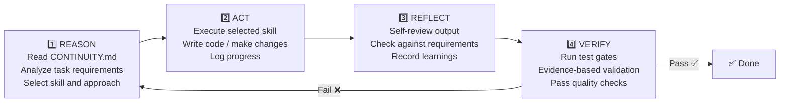
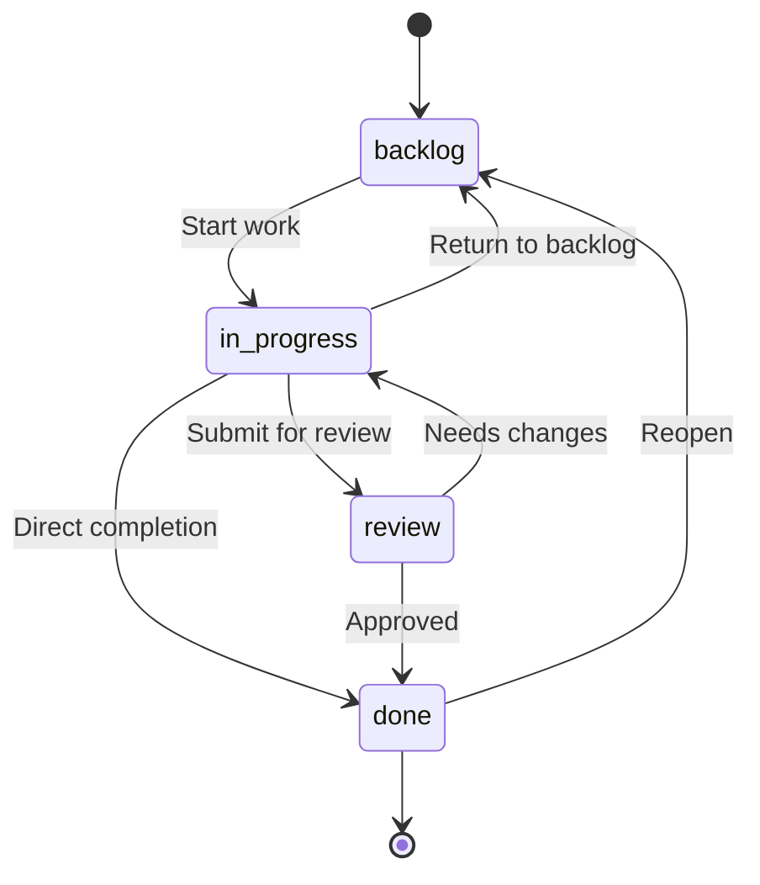
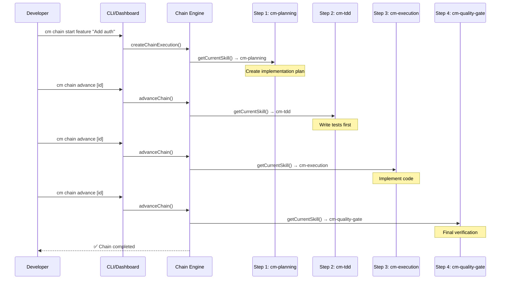
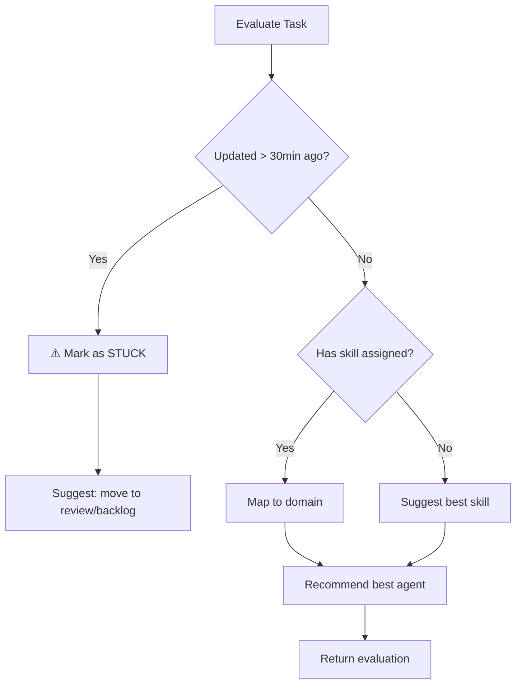

# Data Flow

> **Quick Reference**
> - **Execution Model**: RARV (Reason → Act → Reflect → Verify)
> - **State Machine**: backlog → in-progress → review → done
> - **Storage**: JSON file (`cm-tasks.json`) + `.cm/` directory
> - **Pipeline**: Skill Chain Engine

## RARV Execution Cycle

Every task in Cody Master follows the RARV cycle — a 4-phase execution loop that prevents AI agents from rushing to incomplete solutions.



### Phase Details

| Phase | What happens | Key skill |
|-------|-------------|-----------|
| **REASON** | Read working memory, understand context, pick the right approach | `cm-continuity`, `cm-planning` |
| **ACT** | Execute the plan — write code, fix bugs, create docs | `cm-tdd`, `cm-execution`, `cm-debugging` |
| **REFLECT** | Self-review — did the output match expectations? Record errors. | `cm-code-review`, `cm-continuity` |
| **VERIFY** | Run tests, validate, gather evidence | `cm-quality-gate`, `cm-test-gate` |

## Task State Machine

Tasks flow through a kanban board with validated transitions:



### Valid Transitions

| From | To | Trigger |
|------|----|---------|
| `backlog` | `in-progress` | Developer/agent starts work |
| `in-progress` | `review` | Work completed, needs review |
| `in-progress` | `done` | Work completed and verified |
| `in-progress` | `backlog` | Deprioritized or blocked |
| `review` | `done` | Review approved |
| `review` | `in-progress` | Review found issues |
| `done` | `backlog` | Task needs rework |

:::tip Validation
Invalid transitions are **rejected by the API**. For example, you cannot move a task directly from `backlog` to `done` — it must pass through `in-progress` first.
:::

## Skill Chain Pipeline

Complex workflows are composed as multi-step skill chains. The Chain Engine manages progress through sequential skills:



## Judge Agent Decision Flow

The Judge Agent continuously monitors task health and recommends action:



## Data Storage Schema

All data is stored in a single JSON file (`cm-tasks.json`):

```json
{
  "projects": [
    {
      "id": "uuid",
      "name": "My Project",
      "path": "/path/to/project",
      "agents": ["antigravity", "claude"],
      "createdAt": "ISO-timestamp"
    }
  ],
  "tasks": [
    {
      "id": "uuid",
      "projectId": "uuid",
      "title": "Add authentication",
      "column": "in-progress",
      "priority": "high",
      "agent": "antigravity",
      "skill": "cm-tdd",
      "order": 0,
      "createdAt": "ISO-timestamp",
      "updatedAt": "ISO-timestamp",
      "dispatchStatus": "dispatched"
    }
  ],
  "deployments": [...],
  "changelog": [...],
  "activities": [...],
  "chainExecutions": [...]
}
```

### Working Memory Files (`.cm/` directory)

```
.cm/
├── CONTINUITY.md      # Active session state
├── config.yaml        # RARV cycle settings
└── memory/
    ├── learnings.json  # Captured error patterns
    └── decisions.json  # Architecture decisions
```

## Related

- [Architecture →](./architecture.md)
- [API Reference →](./api/)
- [How It Works →](./how-it-work.md)
