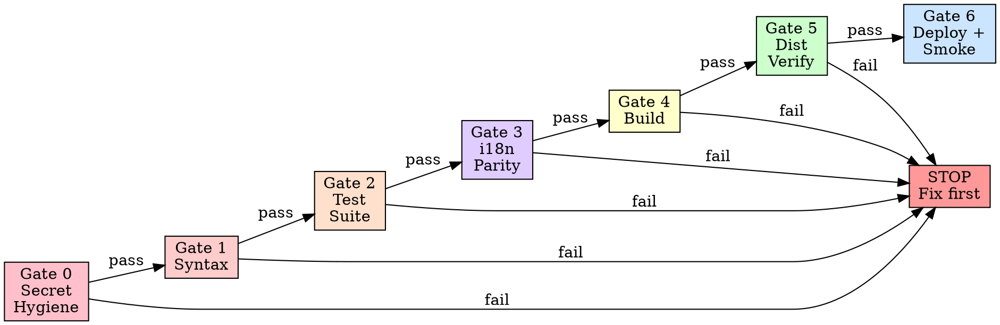

# Safe Deploy Pipeline v2

## Overview

A deploy without gates is a deploy with hope. Hope is not a strategy.

**Core principle:** Every project needs a multi-gate deploy pipeline. Code passes through syntax → tests → i18n → build → verify → deploy, with hard stops at each gate. No gate skipping. No "it'll be fine."

> [!CAUTION]
> **March 2026 Incident:** 572 backend tests passed green while `app.js` had catastrophic syntax errors → white screen in production. This pipeline exists because `test:gate` alone was NOT enough.

## The Iron Law

```
NO DEPLOY WITHOUT PASSING ALL GATES.
GATES ARE SEQUENTIAL. EACH MUST PASS BEFORE THE NEXT RUNS.
SYNTAX CHECK IS GATE 1. IF IT FAILS, NOTHING ELSE RUNS.
```

## When to Use

**ALWAYS** when:
- Setting up a new project's deployment infrastructure
- A project has no test gate before deploy
- Project deploys directly from `git push`
- After a production incident caused by untested code
- Adding CI/CD to an existing project

## The 7-Gate Pipeline



---

### Gate 0: Secret Hygiene (FASTEST FAIL — < 0.5 seconds)

> [!CAUTION]
> **March 2026 Security Incident:** `SUPABASE_SERVICE_KEY` was accidentally committed to `wrangler.jsonc`. This exposed a service-role key that bypasses Row Level Security in git history. Gate 0 prevents this from ever reaching the remote.

**The Rule: Where Each Variable Lives**

| Variable Type | Correct Location | WRONG Location |
|--------------|-----------------|----------------|
| Supabase URL (public) | `wrangler.jsonc` vars section | ❌ Hardcoded in code |
| `SUPABASE_SERVICE_KEY` | Cloudflare Secret (`wrangler secret put`) | ❌ `wrangler.jsonc` |
| `SUPABASE_ANON_KEY` | Cloudflare Secret | ❌ `wrangler.jsonc` |
| DB connection strings | Cloudflare Secret | ❌ Anywhere in repo |
| Local dev secrets | `.dev.vars` (gitignored) | ❌ `wrangler.jsonc` |
| Build config (non-secret) | `wrangler.jsonc` | — |

**Secret Hygiene Check (Enhanced — Repo-Wide):**

> Calls `cm-secret-shield` Layer 4 for deep scanning. Below is the essential check:

```bash
node -e "
const fs = require('fs');
const { execSync } = require('child_process');

// 1. Check wrangler config for secrets
const wranglerFiles = ['wrangler.jsonc', 'wrangler.toml', 'wrangler.json'];
const dangerous = ['SERVICE_KEY', 'ANON_KEY', 'DB_PASSWORD', 'SECRET_KEY', 'PRIVATE_KEY', 'API_SECRET'];
let failed = false;

for (const wf of wranglerFiles) {
  if (!fs.existsSync(wf)) continue;
  const src = fs.readFileSync(wf, 'utf-8');
  for (const key of dangerous) {
    // Check for actual values, not just variable names
    const valuePattern = new RegExp(key + '\\\\s*[=:]\\\\s*[\"\'][a-zA-Z0-9/+=]{20,}', 'g');
    if (valuePattern.test(src)) {
      console.error('❌ DANGEROUS: ' + wf + ' contains a ' + key + ' VALUE');
      console.error('  Fix: wrangler secret put ' + key + ' (then remove from ' + wf + ')');
      failed = true;
    }
  }
}

// 2. Check .gitignore has required patterns
if (fs.existsSync('.gitignore')) {
  const gi = fs.readFileSync('.gitignore', 'utf-8');
  const required = ['.env', '.dev.vars'];
  const missing = required.filter(r => !gi.includes(r));
  if (missing.length > 0) {
    console.error('❌ .gitignore missing: ' + missing.join(', '));
    failed = true;
  }
} else {
  console.error('❌ No .gitignore found!');
  failed = true;
}

// 3. Check .env files aren't tracked by git
try {
  const tracked = execSync('git ls-files', { encoding: 'utf-8' });
  const badFiles = ['.env', '.dev.vars', '.env.local', '.env.production'];
  const trackedBad = badFiles.filter(f => tracked.split('\\n').includes(f));
  if (trackedBad.length > 0) {
    console.error('❌ CRITICAL: Secret files tracked by git: ' + trackedBad.join(', '));
    console.error('   Fix: git rm --cached ' + trackedBad.join(' '));
    failed = true;
  }
} catch (e) { /* not a git repo */ }

if (failed) {
  console.error('\\n🛡️ Gate 0 FAILED. Fix issues above before deploying.');
  process.exit(1);
}
console.log('✅ Gate 0 passed: repo-wide secret hygiene verified');
"
```

**Setup `.dev.vars` for local development:**
```bash
# .dev.vars — local only, NEVER committed
SUPABASE_URL=https://YOUR_PROJECT.supabase.co
SUPABASE_SERVICE_KEY=YOUR_SERVICE_KEY

# Add to .gitignore:
echo ".dev.vars" >> .gitignore

# Commit the template:
cp .dev.vars .dev.vars.example  # Remove values first
git add .dev.vars.example
```

**If secrets were already committed:**
```bash
# Remove from git history (URGENT — do before pushing)
git filter-repo --path wrangler.jsonc --invert-paths  # Nuclear option
# OR just remove the value from wrangler.jsonc and add as secret:
wrangler secret put SUPABASE_SERVICE_KEY
# Then rotate the key immediately in Supabase dashboard
```

---

### Gate 1: Syntax Validation (FAST FAIL)

> [!IMPORTANT]
> This gate runs in < 1 second and catches the EXACT class of errors that caused the March 2026 incident. Run it BEFORE the test suite (which takes 10-30s).

| Stack | Command | What it checks |
|-------|---------|---------------|
| Vanilla JS | `node -c path/to/app.js` | JavaScript parse errors |
| TypeScript | `npx tsc --noEmit` | Type errors + syntax |
| Python | `python -m py_compile app.py` | Python syntax |
| Go | `go vet ./...` | Go static analysis |

**For frontend monoliths without TypeScript:**
```bash
# Ultra-fast syntax check — fails in < 1s if broken
node -c public/static/app.js
```

**Why separate from Gate 2?**
- `node -c` takes < 1 second. Test suite takes 10-30 seconds.
- If syntax is broken, 100% of tests will fail anyway — but with confusing error messages.
- A fast syntax check gives you the EXACT line number of the error instantly.

**REQUIRED SUB-SKILL:** Use `cm-quality-gate` for parser-based validation inside the test suite (Layer 1).

---

### Gate 2: Test Suite

The test suite MUST include:

| Test Category | What it validates | Priority |
|--------------|-------------------|----------|
| **Frontend safety** | JS syntax, function integrity, corruption patterns | **CRITICAL** |
| **Backend API** | Routes return correct data | Required |
| **Business logic** | Calculations, rules, validation | Required |
| **i18n sync** | Translation key parity, orphaned keys | Required for multi-lang |
| **Integration** | End-to-end workflows | Recommended |

**Setup the test:gate script:**
```json
{
  "scripts": {
    "test:gate": "vitest run --reporter=verbose"
  }
}
```

**Gate decision:**
```
IF 0 failures → proceed to Gate 3
IF any failures → STOP. Fix before continuing.
```

**REQUIRED SUB-SKILL:** Use `cm-quality-gate` for enforcement discipline.

---

### Gate 3: i18n Parity Check (for multi-language projects)

> [!NOTE]
> Skip this gate if the project does not have i18n. For projects with i18n, this gate catches what test suites can miss: key drift between languages that causes blank strings in production.

```bash
# All language files must have identical key counts
node -e "
const fs = require('fs');
const path = require('path');
const I18N_DIR = 'public/static/i18n';
const langs = ['vi','en','th','ph'];
const results = {};
let allMatch = true;

for (const lang of langs) {
  const filePath = path.join(I18N_DIR, lang + '.json');
  const data = JSON.parse(fs.readFileSync(filePath, 'utf-8'));
  const flatKeys = JSON.stringify(data).split('\":').length - 1;
  results[lang] = flatKeys;
  console.log(lang + ': ' + flatKeys + ' keys');
}

const counts = Object.values(results);
if (new Set(counts).size !== 1) {
  console.error('❌ KEY PARITY FAILURE! Counts differ across languages.');
  console.error(JSON.stringify(results));
  process.exit(1);
} else {
  console.log('✅ Key parity: all languages have ' + counts[0] + ' keys');
}

// Check for null/empty values
let nullCount = 0;
for (const lang of langs) {
  const data = JSON.parse(fs.readFileSync(path.join(I18N_DIR, lang + '.json'), 'utf-8'));
  const check = (obj, prefix) => {
    for (const [k, v] of Object.entries(obj)) {
      if (k === '_meta') continue;
      if (typeof v === 'object' && v !== null) { check(v, prefix + '.' + k); continue; }
      if (v === null || v === undefined || v === '') {
        console.error('  ⚠ ' + lang + '.' + prefix + '.' + k + ' is null/empty');
        nullCount++;
      }
    }
  };
  check(data, lang);
}
if (nullCount > 0) {
  console.error('❌ Found ' + nullCount + ' null/empty translation values!');
  process.exit(1);
}
console.log('✅ No null/empty values');
"
```

**What this catches:**
- Keys added to `vi.json` but forgotten in `en.json` → blank strings for English users
- Null values from bad translation scripts → `t()` returns key name instead of translation
- Key count drift between languages → inconsistent UX

---

### Gate 4: Build Verification

Production build must succeed without errors.

```bash
npm run build
```

**What this catches that tests don't:**
- Import resolution failures
- Tree-shaking errors
- Missing environment variables
- Asset compilation failures
- Bundle size explosions

**Optional: Bundle size guard:**
```json
{
  "scripts": {
    "build:verify": "npm run build && node -e \"const s=require('fs').statSync('dist/_worker.js').size; if(s>2e6) {console.error('Bundle too large: '+s); process.exit(1)}\""
  }
}
```

---

### Gate 5: Dist Asset Verification (NEW)

> [!IMPORTANT]
> The build can "succeed" but produce an incomplete dist/ directory. This gate catches missing critical assets.

```bash
# Verify critical files exist in dist/
node -e "
const fs = require('fs');
const required = [
  'dist/_worker.js',
  'dist/static/app.js',
  'dist/static/style.css',
  'dist/static/i18n/vi.json',
  'dist/static/i18n/en.json',
  'dist/static/i18n/th.json',
  'dist/static/i18n/ph.json',
];
const missing = required.filter(f => !fs.existsSync(f));
if (missing.length > 0) {
  console.error('❌ Missing files in dist/:');
  missing.forEach(f => console.error('  ' + f));
  process.exit(1);
}
console.log('✅ All ' + required.length + ' critical files present in dist/');
"
```

**Adapt `required` array to your project.** At minimum, verify:
- Worker/server entry point exists
- Frontend JS/CSS files exist
- Translation files are copied
- Critical images/assets are present

---

### Gate 6: Deploy + Post-Deploy Smoke Test

Only after Gates 1-5 pass.

**Deploy command varies by platform:**

| Platform | Command |
|----------|---------|
| Cloudflare Pages | `npx wrangler pages deploy dist/` |
| Vercel | `npx vercel --prod` |
| Netlify | `npx netlify deploy --prod` |

**Post-deploy verification:**
```bash
# Smoke test the deployed URL — must return 200
STATUS=$(curl -s -o /dev/null -w "%{http_code}" https://your-app.pages.dev)
if [ "$STATUS" != "200" ]; then
  echo "❌ POST-DEPLOY SMOKE TEST FAILED! Status: $STATUS"
  echo "⚠ Consider immediate rollback."
  exit 1
fi
echo "✅ Smoke test passed (HTTP $STATUS)"
```

---

## Composing the Deploy Script

### `package.json` (Recommended)
```json
{
  "scripts": {
    "predeploy:syntax": "node -c public/static/app.js",
    "predeploy:i18n": "node scripts/check-i18n-parity.js",
    "predeploy:dist": "node scripts/verify-dist.js",
    "deploy": "npm run predeploy:syntax && npm run test:gate && npm run predeploy:i18n && npm run build && npm run predeploy:dist && YOUR_DEPLOY_COMMAND"
  }
}
```

**Key insight:** Chain gates with `&&`. If any gate fails, the chain stops immediately.

---

## Rollback Protocol

When a deployment causes issues:

| Severity | Action | Command |
|----------|--------|---------|
| **White screen** (syntax) | Revert last commit, redeploy | `git revert HEAD && npm run deploy` |
| **Broken translations** | Revert JSON files, redeploy | `git checkout HEAD~1 -- public/static/i18n/*.json && npm run deploy` |
| **API error** | Revert server code, redeploy | `git revert HEAD && npm run deploy` |
| **Partial breakage** | Cherry-pick fix, deploy | Fix → test → deploy |

**Cloudflare Pages specific:**
```bash
# Rollback to previous deployment
wrangler pages deployments list --project-name prms
wrangler pages deployment rollback <deployment-id> --project-name prms
```

---

## Setting Up for a New Project

### Step 1: Create test infrastructure
```bash
npm install -D vitest acorn
```

### Step 2: Create package.json scripts
```json
{
  "scripts": {
    "test:gate": "vitest run --reporter=verbose",
    "build": "YOUR_BUILD_COMMAND",
    "deploy": "node -c public/static/app.js && npm run test:gate && npm run build && YOUR_DEPLOY_COMMAND"
  }
}
```

### Step 3: Add frontend safety tests
**REQUIRED SUB-SKILL:** Follow `cm-quality-gate` to create test file with all layers.

### Step 4: Create deploy workflow
Create `.agents/workflows/deploy.md`.

---

## Red Flags — STOP

- ❌ Deploying without running test:gate
- ❌ Skipping syntax check ("tests will catch it")
- ❌ Skipping build step ("tests passed so it'll build")
- ❌ Running tests and deploy in parallel
- ❌ "Tests passed last time" (run them NOW)
- ❌ "Only changed one file" (test everything)
- ❌ No frontend safety tests for JS projects
- ❌ No dist/ verification after build
- ❌ No post-deploy smoke test
- ❌ No i18n parity check for multi-language apps

## Rationalization Table

| Excuse | Reality |
|--------|---------|
| "Tests passed earlier" | Code changed since then. Run fresh. |
| "Build always works" | Until it doesn't. 30 seconds to verify. |
| "It's a one-line change" | One line broke 600 lines of app.js. Test it. |
| "CI will catch it" | CI runs AFTER push. Catch BEFORE push. |
| "Just a hotfix" | Hotfixes need MORE testing, not less. |
| "Syntax check is redundant" | `node -c` takes 0.5s and prevented the March 2026 disaster. |
| "i18n parity is overkill" | Missing keys → blank strings in production. |
| "dist/ is always complete" | Build tools can silently skip assets. Check. |

## Integration with Other Skills

| Skill | When |
|-------|------|
| `cm-quality-gate` | Setting up Gate 2 frontend tests and Test Gate |
| `cm-secret-shield` | Gate 0 calls Secret Shield Layer 4 for deep scanning |
| `cm-safe-i18n` | Adding i18n-specific gates |
| `cm-terminal` | Monitoring gate commands |
| `cm-identity-guard` | Gate 0 verifies deploy identity |

## The Bottom Line

**6 gates. Sequential. Each must pass. No exceptions.**

Syntax → Tests → i18n → Build → Dist Verify → Deploy + Smoke.

This is non-negotiable.
