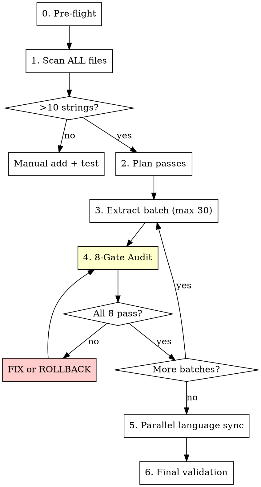

# Safe i18n Translation v2.0

## Overview

Mass i18n conversion is the most dangerous code transformation in a frontend monolith. A single-pass conversion of 600+ strings corrupted `app.js` beyond repair while 572 backend tests passed green. Additional incidents include HTML tag corruption, variable shadowing, and placeholder translation errors.

**Core principle:** Every batch of i18n changes MUST pass ALL 8 audit gates before proceeding. No exceptions.

**Violating the letter of this rule is violating the spirit of this rule.**

## The Iron Law

```
NO BATCH WITHOUT PASSING ALL 8 AUDIT GATES.
NO LANGUAGE FILE WITHOUT KEY PARITY.
NO DEPLOY WITHOUT FULL SYNTAX VALIDATION.
NO HTML TAG MODIFICATION — TEXT CONTENT ONLY.
NO REGEX TO FIX REGEX ERRORS — USE LEXICAL SCANNER.
```

## When to Use

**ALWAYS** when any of these happen:
- Extracting hardcoded strings to `t()` calls
- Adding new language file (e.g., `ph.json`)
- Mass-converting strings across >10 lines
- Updating translation keys or namespaces
- Migrating i18n library or pattern

**Don't use for:**
- Adding 1-3 translation keys (just add manually + test)
- Fixing a single typo in a JSON file

## The Protocol



---

### Phase 0: Pre-Flight Checks (NEW)

Before ANY i18n work:

```bash
# NEVER work on main
git checkout -b i18n/$(date +%Y%m%d)-target-description

# Verify baseline is clean
node -c public/static/app.js
npm run test:gate
```

If either fails, DO NOT PROCEED. Fix the baseline first.

---

### Phase 1: Scan ALL Frontend Files (IMPROVED)

> [!CAUTION]
> **Lesson #11:** `import-adapters.js` and `import-engine.js` had 60+ hardcoded strings that were initially missed because only `app.js` was scanned.

Scan EVERY file that produces user-visible UI text:
```bash
# Scan ALL .js files for Vietnamese strings
node scripts/i18n-lint.js

# Also check non-app.js files
grep -rnP '[àáạảãâầấậẩẫăằắặẳẵ]' public/static/*.js --include="*.js" | grep -v "\.backup" | grep -v "i18n"
```

Group strings by **functional domain** — never by file position:

| Pass | Domain | Example Keys |
|------|--------|-------------|
| 1 | Core UI | `sidebar.*`, `common.*`, `login.*` |
| 2 | Primary Feature | `vio.*`, `emp.*`, `scores.*` |
| 3 | Config & Settings | `config.*`, `benconf.*` |
| 4 | Reports & Export | `report.*`, `export.*` |
| 5 | Secondary Files | `import-adapters.js`, `import-engine.js` |
| 6 | Edge cases | Tooltips, error messages, dynamic labels |

**Output:** A numbered list of passes with estimated string count per pass per FILE.

---

### Phase 2: Extract Batch (MAX 30 strings per batch)

> [!CAUTION]
> **MAX 30 strings per batch. Not 31. Not "about 30". Exactly 30 or fewer.**
> The i18n crash happened because 600+ strings were done in one pass.

For each batch:

1. **Identify** up to 30 hardcoded strings in the current pass domain
2. **Generate** namespace-compliant keys: `domain.descriptive_key`
3. **Replace** strings with `t('domain.key')` calls
4. **Add** keys to the **primary** language JSON (usually `vi.json`)

#### String Replacement Rules (12 Bug Categories Encoded)

```javascript
// ✅ CORRECT — backtick template with t() inside
`<div>${t('login.welcome')}</div>`

// ✅ CORRECT — concatenation
'<div>' + t('login.welcome') + '</div>'

// ❌ BUG #1 (FATAL) — single-quote wrapping template expression
'${t("login.welcome")}'     // ← THIS DESTROYED APP.JS

// ❌ BUG #4 — mismatched delimiters
t('login.welcome`)           // ← quote/backtick mismatch
t(`login.welcome')           // ← backtick/quote mismatch
```

#### Ternary Inside Template Literals (Bug #5)
```javascript
// ❌ BROKEN — single-quote ternary result with template expression
${ canDo ? '...${t('key')}...' : '' }

// ✅ CORRECT — backtick ternary result
${ canDo ? `...${t('key')}...` : '' }
```

#### Variable Shadowing (Bug #3)
```javascript
// ❌ BROKEN — shadows global t() translation function
items.map((t, i) => `<div>${t('key')}</div>`)

// ✅ CORRECT — use different variable name
items.map((item, i) => `<div>${t('key')}</div>`)
```

#### HTML Tag Protection (Bug #2)
```javascript
// ❌ NEVER modify content inside HTML tags
`< div class="card" >`    // spaces inside tags = broken rendering
`style = "color: red"`     // space around = breaks attributes
`<!-- text-- >`            // broken comment closers

// ✅ ONLY replace text content between tags
`<div class="card">${t('card.title')}</div>`
```

#### Static Keys Only (Bug #8)
```javascript
// ❌ FORBIDDEN — dynamic keys can't be statically validated
t('nav.' + pageName)
t(`messages.${type}`)

// ✅ REQUIRED — static keys only
t('nav.dashboard')
t('nav.employees')
```

---

### Phase 3: 8-Gate Audit (MANDATORY after every batch)

> [!IMPORTANT]
> All 8 gates must pass. **Any failure = STOP and FIX before continuing.**

```bash
# Gate 1: JavaScript syntax (fast, <1s)
node -c public/static/app.js
# Must output: "public/static/app.js: No syntax errors"

# Gate 2: Syntax check on ALL modified .js files
node -c public/static/import-adapters.js 2>/dev/null
node -c public/static/import-engine.js 2>/dev/null

# Gate 3: Corruption pattern check (catches what node -c misses)
grep -nP "=\s*'[^']*\$\{t\(" public/static/app.js
# Must return 0 matches

# Gate 4: Mismatched delimiter check
grep -nP "t\('[^']*\`\)" public/static/app.js
grep -nP "t\(\`[^']*'\)" public/static/app.js
# Must return 0 matches each

# Gate 5: HTML tag integrity (NEW — Bug #2)
grep -nP "<\s+\w" public/static/app.js | head -5
grep -nP "</\s+\w" public/static/app.js | head -5
grep -nP "--\s+>" public/static/app.js | head -5
grep -nP '\w+\s+=\s+"' public/static/app.js | grep -v "==\|!=\|<=\|>=" | head -5
# Must return 0 matches (excluding legitimate JS operators)

# Gate 6: Variable shadowing check
grep -nP "\.\s*(map|filter|forEach|reduce)\s*\(\s*\(\s*t\s*[,)]" public/static/app.js
# Must return 0 matches

# Gate 7: JSON validity
node -e "JSON.parse(require('fs').readFileSync('public/static/i18n/vi.json'))"

# Gate 8: Full test suite
npm run test:gate
# Must output: 0 failures
```

**Audit Summary Table:**

| Gate | Check | Command | Pass Criteria | Bug # Prevented |
|------|-------|---------|---------------|-----------------|
| 1 | JS syntax (main) | `node -c app.js` | No syntax errors | #1, #4 |
| 2 | JS syntax (all files) | `node -c *.js` | No syntax errors | #11 |
| 3 | Corruption pattern | grep `= '..${t(` | 0 matches | #1 |
| 4 | Delimiter mismatch | grep mixed delims | 0 matches | #4 |
| 5 | HTML tag integrity | grep `< div`, `</ div` | 0 matches | #2 |
| 6 | Variable shadowing | grep `.map((t,` | 0 matches | #3 |
| 7 | JSON valid | `JSON.parse()` | No parse errors | #6 |
| 8 | Full test suite | `npm run test:gate` | 0 failures | #9 |

**If ALL 8 gates pass → commit:**
```bash
git add -A && git commit -m "i18n pass N batch M/T: domain description (X strings)"
```

**If ANY gate fails → FIX immediately.** Do NOT proceed to next batch.

**If fix attempt uses regex → STOP.** Use the lexical scanner instead (Bug #10).

---

### Phase 4: Parallel Language Sync

**REQUIRED SUB-SKILL:** Use `cm-execution` (Parallel mode).

After ALL strings are extracted to the primary language, sync remaining languages **in parallel**:

```
Agent 1 → Translate all keys to en.json (English)
Agent 2 → Translate all keys to th.json (Thai)  
Agent 3 → Translate all keys to ph.json (Filipino)
```

**Each agent prompt MUST include:**
```markdown
Translate the following i18n keys from vi.json to [LANGUAGE]:

Source file: public/static/lang/vi.json
Target file: public/static/lang/[LANG].json

Rules:
1. Translate ALL keys — missing keys will break the app
2. Keep key names EXACTLY the same (only values change)
3. Keep {{param}} interpolation placeholders intact — NEVER translate them
4. Do NOT translate technical terms (e.g., PPH, KPI, CSV)
5. Preserve HTML entities if present in values
6. Do NOT produce empty string "" values — every key must have content
7. Preserve the exact same JSON structure/nesting

After translation:
1. Validate JSON: node -e "JSON.parse(require('fs').readFileSync('[LANG].json'))"
2. Count keys must EQUAL vi.json key count
3. No null or empty string values
4. All {{param}} placeholders preserved identically

Return: Key count + any untranslatable terms flagged.
```

**After agents return — 3-Point Parity Check:**
```bash
# Check 1: Key count parity
node -e "
const fs = require('fs');
const langs = ['vi','en','th','ph'];
const counts = langs.map(l => {
  const keys = Object.keys(JSON.parse(fs.readFileSync('public/static/i18n/'+l+'.json')));
  console.log(l + ': ' + keys.length + ' keys');
  return keys.length;
});
if (new Set(counts).size !== 1) {
  console.error('❌ KEY PARITY FAILURE! Counts differ across languages.');
  process.exit(1);
} else {
  console.log('✅ Key parity: all languages have ' + counts[0] + ' keys');
}
"

# Check 2: Empty value detection (NEW — prevents blank UI)
node -e "
const fs = require('fs');
const langs = ['vi','en','th','ph'];
let hasEmpty = false;
for (const lang of langs) {
  const data = JSON.parse(fs.readFileSync('public/static/i18n/' + lang + '.json'));
  const check = (obj, prefix) => {
    for (const [k, v] of Object.entries(obj)) {
      const key = prefix ? prefix + '.' + k : k;
      if (v === '' || v === null) { console.error('❌ Empty value: ' + lang + ':' + key); hasEmpty = true; }
      if (typeof v === 'object' && v !== null) check(v, key);
    }
  };
  check(data, '');
}
if (hasEmpty) process.exit(1);
console.log('✅ No empty values');
"

# Check 3: Placeholder preservation (NEW — Bug #7)
node -e "
const fs = require('fs');
const vi = JSON.parse(fs.readFileSync('public/static/i18n/vi.json'));
const flatten = (obj, pre='') => Object.entries(obj).reduce((a, [k,v]) => {
  const key = pre ? pre+'.'+k : k;
  if (typeof v === 'object' && v !== null && !Array.isArray(v)) return [...a, ...flatten(v, key)];
  return [...a, [key, v]];
}, []);
const viFlat = Object.fromEntries(flatten(vi));
let errors = 0;
for (const lang of ['en','th','ph']) {
  const other = Object.fromEntries(flatten(JSON.parse(fs.readFileSync('public/static/i18n/'+lang+'.json'))));
  for (const [key, viVal] of Object.entries(viFlat)) {
    if (typeof viVal !== 'string') continue;
    const viParams = (viVal.match(/\{\{[^}]+\}\}/g) || []).sort().join(',');
    const otherVal = other[key] || '';
    const otherParams = (otherVal.match(/\{\{[^}]+\}\}/g) || []).sort().join(',');
    if (viParams && viParams !== otherParams) {
      console.error('❌ ' + lang + ':' + key + ' placeholder mismatch: vi=' + viParams + ' ' + lang + '=' + otherParams);
      errors++;
    }
  }
}
if (errors) process.exit(1);
console.log('✅ All placeholders preserved');
"
```

---

### Phase 5: Final Validation

```bash
# 1. Full syntax check on ALL frontend files
for f in public/static/app.js public/static/import-adapters.js public/static/import-engine.js; do
  [ -f "$f" ] && node -c "$f"
done

# 2. Full test gate (includes frontend-safety + i18n-sync tests)
npm run test:gate

# 3. Build
npm run build

# 4. Remaining hardcoded scan (should be ~0)
node scripts/i18n-lint.js

# 5. Manual smoke test — switch languages in browser
```

**Commit and merge:**
```bash
git add -A && git commit -m "i18n: complete [scope] - N strings across M languages"
git checkout main
git merge i18n/...
```

---

## Quick Reference: Key Naming Convention

| Namespace | Usage | Example |
|-----------|-------|---------| 
| `common` | Shared UI (buttons, statuses) | `common.save`, `common.cancel` |
| `login` | Authentication flows | `login.welcome`, `login.forgot_pw` |
| `sidebar` | Navigation menu | `sidebar.dashboard`, `sidebar.logout` |
| `vio` | Violations module | `vio.confirm_title`, `vio.level_high` |

---

## The 13 Bug Categories — Quick Reference

| # | Bug | Pattern | Detection Gate |
|---|-----|---------|---------------|
| 1 | Single-quote wrapping `${t()}` | `= '..${t(..'` | Gate 3 |
| 2 | HTML tag corruption | `< div`, `</ div`, `-- >` | Gate 5 |
| 3 | Variable shadowing | `.map((t,` | Gate 6 |
| 4 | Mismatched delimiters | `t('key\`)`, `t(\`key')` | Gate 4 |
| 5 | Ternary nesting trap | Single-quote branch with `${t()}` | Gate 1 + 3 |
| 6 | Key parity failures | Missing keys in some languages | Phase 4 parity |
| 7 | Placeholder translation | `{{count}}` → `{{จำนวน}}` | Phase 4 placeholder check |
| 8 | Dynamic key concatenation | `t('nav.' + var)` | Static analysis |
| 9 | Backend pass, frontend broken | 572 tests green, white screen | Gate 1 + 8 |
| 10 | Regex fixing regex | Infinite fix-break loop | Use lexical scanner |
| 11 | Missed files | Only scanned app.js | Phase 1 scan ALL |
| 12 | Line number drift | Stale line refs across batches | Target by function name |
| 13 | **Flat vs nested key count mismatch** | Test vs Gate metrics | i18n-sync test design |

---

## Red Flags — STOP Immediately

- ❌ Converting >30 strings without running ALL 8 audit gates
- ❌ Using find-replace without verifying backtick vs single-quote context
- ❌ Committing all translations in a single commit
- ❌ Skipping key parity check across language files
- ❌ "It's just a string replacement, it'll be fine"

## Rationalization Table

| Excuse | Reality |
|--------|---------|
| "It's just find-replace" | Find-replace destroyed app.js. MAX 30 strings per batch. |
| "The regex handles everything" | Regex false-positives crashed the app. 8 audit gates after each batch. |
| "I'll test at the end" | You won't find which of 600 changes broke it. Test after each 30. |
| "One commit is cleaner" | One commit = one rollback point for 600 changes. Granular commits. |

## Integration with Other Skills

| Skill | When |
|-------|------|
| `cm-quality-gate` | Final test gate before deploy |
| `cm-execution` | Phase 4: Parallel language translation |
| `cm-terminal` | While running audit commands |

## The Bottom Line

**30 strings per batch. 8 audit gates after each. No exceptions.**

The i18n incidents of March 2026 produced 12 distinct bug categories. This skill encodes protections against every single one. Follow the protocol exactly.
