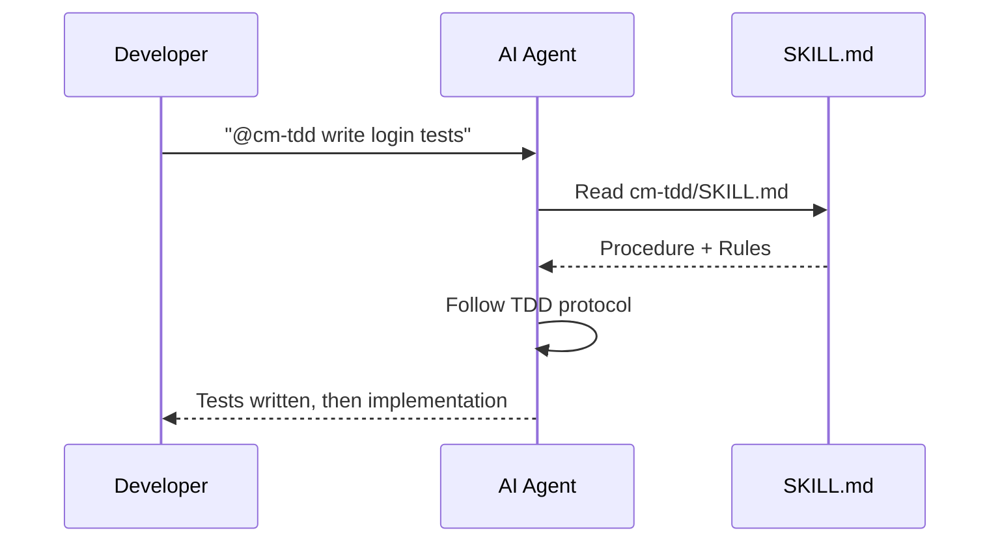

# Using Skills

> **Quick Reference**
> - **Total Skills**: 30+ across 5 swarms
> - **Invocation**: Platform-specific commands (see table below)
> - **Format**: Universal markdown — SKILL.md
> - **Customizable**: Fork and modify any skill

## How Skills Work

Skills are **markdown instruction files** that AI agents read and follow. When you invoke a skill, the AI agent:

1. Reads the SKILL.md file
2. Follows the documented procedure step-by-step
3. Applies the rules and constraints defined in the skill



## Invoking Skills

Each platform has its own syntax:

| Platform | Syntax | Example |
|----------|--------|---------|
| Antigravity (Gemini) | `@[/skill-name]` | `@[/cm-tdd] write auth tests` |
| Claude Code | `/skill-name` | `/cm-tdd write auth tests` |
| Cursor | `@skill-name` | `@cm-tdd write auth tests` |
| Windsurf | `@skill-name` | `@cm-tdd write auth tests` |
| Cline | `@skill-name` | `@cm-tdd write auth tests` |

## Skill Discovery

### Via CLI

```bash
# List all skills
cm skill list

# Get info about a specific skill
cm skill info cm-tdd

# List skills by domain
cm skill domains
```

### Via Dashboard

Open the dashboard and navigate to the **Skills** tab to browse available skills with descriptions.

### Via Documentation

Browse the full [Skills Library →](../skills/) with complete documentation for every skill.

## Skill Categories (Swarms)

| Swarm | Skills | Purpose |
|-------|--------|---------|
| 🔧 Engineering | cm-tdd, cm-debugging, cm-quality-gate, cm-test-gate, cm-code-review | Code quality & testing |
| ⚙️ Operations | cm-safe-deploy, cm-identity-guard, cm-git-worktrees, cm-terminal | Safe deployment & ops |
| 🎨 Product | cm-planning, cm-brainstorm-idea, cm-ux-master, cm-ui-preview, cm-dockit, cm-readit, cm-project-bootstrap | Strategic analysis, planning & design |
| 📈 Growth | cm-content-factory, cm-ads-tracker | Marketing & analytics |
| 🎯 Orchestration | cm-execution, cm-continuity, cm-skill-chain, cm-skill-mastery, cm-safe-i18n | Coordination & automation |

## Chaining Skills

Use Skill Chains to compose multi-skill workflows:

```bash
# List available chains
cm chain list

# Start a "feature" chain
cm chain start feature "Add user authentication"

# Auto-detect is best chain
cm chain auto "Fix the login bug"
```

### Built-in Chains

| Chain | Steps | Use Case |
|-------|-------|----------|
| `feature` | planning → tdd → execution → review → deploy | New feature development |
| `bugfix` | debugging → tdd → execution → review | Bug investigation & fix |
| `deploy` | quality-gate → safe-deploy | Production deployment |

## Customizing Skills

Fork any skill and modify it:

```bash
# Copy a skill to your project
cp -r skills/cm-tdd my-skills/cm-tdd

# Edit SKILL.md to customize
vim my-skills/cm-tdd/SKILL.md
```

### Skill Format

```yaml
---
name: my-custom-skill
description: "When to use this skill"
---

# Skill Name

> One-line summary

## When to Use
[Trigger conditions]

## Procedure
[Step-by-step instructions]

## Rules
[Do's and Don'ts]
```

## Best Practices

1. **Start with `cm-planning`** — Always plan before executing
2. **Use `cm-tdd`** — Write tests first, then implement
3. **End with `cm-quality-gate`** — Never deploy without verification
4. **Enable `cm-continuity`** — Working memory prevents repeating mistakes
5. **Chain skills** for complex workflows — Don't manually invoke each one

## Next Steps

- [Skills Library →](../skills/) — Browse all skills with full documentation
- [Dashboard Guide →](./dashboard.md) — Task management
- [Working Memory →](./working-memory.md) — Context persistence
