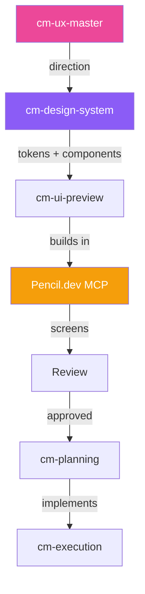

# Prototype + Design System with Pencil.dev

> **Design system ≠ decoration. Design system = architecture.** Build your prototype FROM the system — not around it.

## Who This Is For

- Product designers creating high-fidelity prototypes
- Design leads establishing visual standards for the team
- Designers who want pixel-perfect, developer-ready outputs

**Prerequisites:** CodyMaster with Pencil.dev MCP enabled

## What You'll Create

- ✅ Complete design system (.pen file) with all tokens and components
- ✅ Multi-screen interactive prototype using the system
- ✅ Component variants (hover, active, disabled states)
- ✅ Developer-ready specifications and exports
- ✅ Consistent design language across every screen

---

## The Workflow

### Phase 1: Define the Design Direction

Get inspired before building:

```
@[/cm-ux-master] I need to design a project management tool.
Target: SaaS, desktop-first, dark mode preferred.
Competitors: Linear, Notion, Asana.
What design direction should I take?
```

**Agent applies:**
- 48 UX Laws (Fitts's, Hick's, Miller's, etc.)
- 37 Design Tests
- Competitive visual analysis

**Output:** Design direction document with recommended aesthetic, color mode, typography, and interaction patterns.

### Phase 2: Build the Design System

Create the foundation in Pencil.dev:

```
@[/cm-design-system] Create a design system for a dark-mode 
project management tool. Modern, minimal, inspired by Linear.
```

**The agent creates in Pencil.dev:**

#### Tokens (Variables)
```
Colors:
  Background:    #09090B (zinc-950)
  Surface:       #18181B (zinc-900)
  Border:        #27272A (zinc-800)
  Text Primary:  #FAFAFA (zinc-50)
  Text Secondary:#A1A1AA (zinc-400)
  Accent:        #818CF8 (indigo-400)
  Success:       #34D399
  Warning:       #FBBF24
  Error:         #F87171

Typography:
  Font: Inter
  Scale: 11 / 12 / 13 / 14 / 16 / 20 / 24 / 32

Spacing:
  Unit: 4px
  Scale: 2 / 4 / 6 / 8 / 12 / 16 / 20 / 24 / 32 / 48

Radius:
  SM: 4px | MD: 8px | LG: 12px | Full: 9999px
```

#### Components (Reusable)
```
✅ Button      — Primary, Secondary, Ghost, Danger (4 variants)
✅ Input       — Text, Select, Search, Date picker (4 variants)
✅ Card        — Base, Interactive, Stat, Kanban (4 variants)
✅ Badge       — Status, Priority, Label (3 variants)
✅ Avatar      — Photo, Initials, Stack (3 variants)
✅ Table       — Sortable with row actions
✅ Sidebar     — Collapsible with nested items
✅ Modal       — Small, Medium, Large (3 sizes)
✅ Toast       — Info, Success, Warning, Error (4 variants)
✅ Dropdown    — Menu with icons and shortcuts
```

### Phase 3: Compose Screens

Now build screens using ONLY the design system components:

```
@[/cm-ui-preview] Create the main project board screen.
Use sidebar navigation + kanban board layout.
All components must come from the design system.
```

**Screen list for a project management tool:**

```
Screen 1: Project Board (Kanban view)
  → Sidebar (component) + Board layout + Kanban cards (component)

Screen 2: Issue Detail
  → Modal (component) + Form inputs (component) + Comments section

Screen 3: Settings
  → Sidebar (component) + Form layout + Toggles

Screen 4: Team View
  → Table (component) + Avatar stack (component) + Badges (component)
```

**Each screen is built from design system components — nothing ad-hoc:**

```
@[/cm-ui-preview] Create Screen 2: Issue Detail
- Full-width modal with sections: Title, Description, Properties, Activity
- Properties: Status badge, Priority badge, Assignee avatar, Due date
- Activity: Comment list with user avatars and timestamps
- All from the design system — no custom styles
```

### Phase 4: Add Component States

Make the prototype feel real by defining interaction states:

```
@[/cm-ui-preview] Add interaction states to the button component:
- Default: Background #818CF8, text white
- Hover: Background #6366F1 (darker), translateY(-1px)
- Active: Background #4F46E5 (darkest), translateY(0)
- Disabled: Opacity 50%, cursor not-allowed
- Loading: Spinner icon, text "Loading..."
```

### Phase 5: Validate & Export

#### Design Review
```
@[/cm-ux-master] Review all screens against UX best practices.
Check: accessibility (WCAG AA), Fitts's Law compliance, 
information hierarchy, cognitive load.
```

#### Export for Development
```
@[/cm-ui-preview] Export all screens as high-res PNG for dev handoff
```

**What developers receive:**
- Full screen PNG exports (2x resolution)
- Design token file (CSS variables)
- Component specification (sizes, spacing, colors)
- .pen file for direct reference

### Phase 6: Implementation Bridge

The prototype becomes the implementation spec:

```
@[/cm-planning] Implement the project management UI
based on the Pencil.dev design system and prototype screens.
Match pixel-perfect to the designs.
```

---

## Design System Principles

### The Golden Rule

```
❌ WRONG: Design screen → extract tokens → call it a "system"
✅ RIGHT: Define tokens → build components → compose screens
```

### Component Hierarchy

```
Tokens (colors, fonts, spacing)
  └── Primitives (button, input, badge)
       └── Compounds (card with header, form group)
            └── Patterns (sidebar, kanban column)
                 └── Screens (full page compositions)
```

### Consistency Checklist

- [ ] Every color used appears in the token palette
- [ ] Every font-size appears in the type scale
- [ ] Every spacing value is a multiple of the base unit
- [ ] Every component has a reusable Pencil.dev node
- [ ] No "magic numbers" — everything traces to a token

---

## Skills Involved



## Tips

| Tip | Why |
|-----|-----|
| **Define tokens before components** | Tokens are the DNA; components are the organs |
| **Name components semantically** | "PrimaryButton" not "BlueButton" — colors change |
| **Use variants, not duplicates** | One Button component with 4 states > 4 separate buttons |
| **Test dark + light mode** | If your tokens support theming, verify both |
| **Keep the .pen file in version control** | Design decisions should be tracked like code |
| **Design at 2x export** | Retina-ready from day one |
