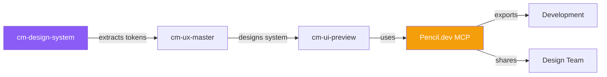

# Redesign with Pencil.dev

> **Extract. Rebuild. Unify.** Take an existing app, create a new design system from scratch in Pencil.dev, and give both dev and design a single source of truth.

## Who This Is For

- Product designers tasked with redesigning an existing app
- Design-dev teams wanting a shared design system
- UX leads migrating from disparate styles to a unified system

**Prerequisites:** CodyMaster with Pencil.dev MCP enabled, existing app to redesign

## What You'll Build

- ✅ Extracted design tokens from the existing app
- ✅ New design system built in Pencil.dev (.pen file)
- ✅ Reusable components (buttons, cards, forms, navigation)
- ✅ Redesigned screens using the new system
- ✅ Exportable assets for both design and development

---

## The Workflow

### Phase 1: Extract Current Design Tokens

First, understand what exists:

```
@[/cm-design-system] Extract the design system from our current app.
URL: https://our-app.com
Focus on: colors, typography, spacing, component patterns
```

**What the agent does:**
1. Harvests visual tokens from the existing site (Harvester v5)
2. Maps current colors, fonts, spacing, border-radius
3. Identifies component patterns (buttons, cards, forms, nav)
4. Produces a design token audit

**Output:**
```
📊 Current Design Token Audit

Colors:
  Primary: #3B82F6 (used 47 times)
  Secondary: #6B7280 (used 23 times)
  Danger: #EF4444 (used 8 times)
  ⚠️ Found 12 one-off colors (inconsistent!)

Typography:
  Headings: Inter Bold (700)
  Body: Inter Regular (400)
  ⚠️ 3 font-sizes used only once

Spacing:
  Base unit: 8px grid (mostly consistent)
  ⚠️ 5 instances of non-grid values

Components:
  ✅ Buttons: 3 variants (primary, secondary, ghost)
  ⚠️ Cards: 4 different card patterns (inconsistent)
  ❌ Forms: No consistent input styling
```

### Phase 2: Design the New System

Open Pencil.dev and build the foundation:

```
@[/cm-ux-master] Design a new design system based on the token audit.
Fix the inconsistencies. Create a modern, cohesive system.
Style: Clean, professional, accessible (WCAG AA)
```

**The agent works in Pencil.dev MCP:**

1. **Opens new document** → creates the design system canvas
2. **Defines tokens** — colors, typography, spacing, border-radius
3. **Creates components** — button, input, card, badge, navigation
4. **Marks reusable** — each component becomes an instanceable reference

```
🎨 Design System Created in Pencil.dev

Colors:
  Primary: #3B82F6 → #2563EB (improved contrast)
  Neutral: 10-shade scale (50-950)
  Semantic: Success #16A34A, Warning #F59E0B, Error #DC2626

Typography:
  Font: Inter (all weights)
  Scale: 12/14/16/18/20/24/30/36/48

Spacing:
  Base: 4px
  Scale: 4/8/12/16/20/24/32/40/48/64

Components Created:
  ✅ Button (primary, secondary, ghost, danger) — 4 variants
  ✅ Input (text, select, textarea, checkbox) — 4 variants
  ✅ Card (base, interactive, stat) — 3 variants
  ✅ Badge (status colors) — 5 variants
  ✅ Navigation (sidebar, topbar) — 2 variants
  ✅ Table (sortable, filterable) — 1 component
```

### Phase 3: Redesign Key Screens

Apply the new system to redesign the app's screens:

```
@[/cm-ui-preview] Redesign the dashboard using the new design system.
Use the components we just created. Layout: sidebar + main content.
```

**The agent:**
1. Gets design guidelines from Pencil MCP
2. Gets a style guide for visual inspiration
3. Assembles the screen using the reusable components
4. Applies consistent spacing, colors, and typography

```
Iterate on the design:

@[/cm-ui-preview] Edit the dashboard:
- Stat cards should show trend arrows (up green, down red)
- Sidebar should have active state highlighting
- Add breadcrumb navigation at the top
```

### Phase 4: Design Review & Export

Screenshot the final designs for review:

```
@[/cm-ui-preview] Export all screens as PNG for stakeholder review
```

**Export options:**
- PNG/JPEG/WEBP for presentations
- PDF for documentation
- .pen file — designers open directly in Pencil.dev
- Design tokens → CSS variables for developers

### Phase 5: Bridge to Development

The design system in Pencil.dev becomes the **shared source**:

| Who | What They Get |
|-----|--------------|
| **Designers** | .pen file with all components + screens |
| **Developers** | Design tokens as CSS variables + component specs |
| **PMs** | PNG exports for stakeholder presentations |
| **AI Agents** | Component IDs for automated implementation |

```
@[/cm-planning] Implement the redesigned dashboard 
using the Pencil.dev design system as the source of truth
```

---

## Skills Involved



## Tips

| Tip | Why |
|-----|-----|
| **Extract before redesigning** | Know what exists before deciding what to change |
| **Fix token inconsistencies first** | A consistent system is better than a pretty one |
| **Build components before screens** | Components are the atoms; screens are molecules |
| **Test accessibility** | WCAG AA contrast ratios — non-negotiable |
| **Version the .pen file in git** | Track design changes alongside code changes |
