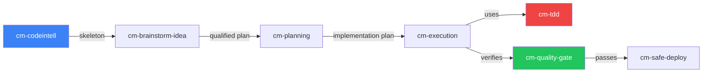

# Refactor an Existing Project

> **Understand first. Plan surgically. Refactor safely.** Use code intelligence to see the full impact of every change before making it.

## Who This Is For

- Senior developers tasked with modernizing a legacy codebase
- Teams migrating from one framework/architecture to another
- Developers cleaning up accumulated tech debt

**Prerequisites:** CodyMaster installed, AI agent configured, Git initialized

## What You'll Build

By the end of this workflow:
- ✅ Complete structural map of the existing codebase
- ✅ Refactoring plan with impact analysis
- ✅ Incremental refactored code with full test coverage
- ✅ Zero regressions, verified through quality gates

---

## Step-by-Step Workflow

### Step 1: Index the Codebase (2 minutes)

Start by building a structural understanding of the project:

```bash
# From project root — generates .cm/skeleton.md
bash scripts/index-codebase.sh
```

Or ask your AI agent:

```
@[/cm-start] I need to refactor this project. Start by analyzing the codebase.
```

**What happens:**
1. `cm-codeintell` runs the Skeleton Indexer → `.cm/skeleton.md`
2. Agent reads the skeleton (~5K tokens) and understands every function, class, route
3. Working memory initialized via `cm-continuity`

**Output:** Architecture map in ~5K tokens instead of reading 200+ files

### Step 2: Identify Refactoring Targets

```
@[/cm-brainstorm-idea] Analyze this codebase for refactoring opportunities.
Focus on: tech debt, duplicated code, unclear architecture, and scalability issues.
```

**The agent will:**
1. Read `.cm/skeleton.md` for structural overview
2. Identify dependency clusters and tight coupling
3. Run the 9 Windows Analysis (current state → ideal future)
4. Produce 2-3 refactoring strategies with trade-offs

**Example output:**
```
Option A: Module Extraction (M effort, low risk)
  → Extract shared utilities into /lib, consolidate API routes

Option B: Architecture Migration (L effort, medium risk)
  → Move from monolithic to Domain-Driven folders

Option C: Full Rewrite (XL effort, high risk)
  → Start fresh with new design patterns

🎯 Recommendation: Option A first, then Option B incrementally
```

### Step 3: Plan the Refactoring

```
@[/cm-planning] Execute Option A from the brainstorm analysis.
Create an incremental refactoring plan — never break existing tests.
```

**The plan will include:**
- File-by-file change list with expected impact
- Dependency tree showing what each change affects
- Test coverage requirements per change
- Git branch strategy (feature branches per refactoring unit)

### Step 4: Execute with TDD Safety Net

```
@[/cm-execution] Execute the refactoring plan using Mode D (RARV batch)
```

**For each refactoring unit, the RARV cycle:**

```
🧪 RED:    Write test capturing CURRENT behavior
🟢 GREEN:  Refactor the code — test must still pass
🔄 REFACTOR: Clean up the refactored code
✅ VERIFY: Run full test suite — zero regressions
📝 COMMIT: Git checkpoint with clear message
```

> **Critical:** Always write a characterization test BEFORE refactoring. This captures the existing behavior as the safety net.

### Step 5: Verify with Quality Gates

```
@[/cm-quality-gate] Full 6-gate check on the refactored code
```

```
✅ Gate 1: Static analysis — 0 errors
✅ Gate 2: All tests pass, coverage maintained
✅ Gate 3: Blind code review — clean
✅ Gate 4: Anti-sycophancy — no hidden issues
✅ Gate 5: Security scan — no regressions
✅ Gate 6: i18n integrity — keys intact
```

### Step 6: Deploy Incrementally

```
@[/cm-safe-deploy] Deploy to staging for verification
```

---

## Skills Involved



## Tips & Gotchas

| Tip | Why |
|-----|-----|
| **Always index first** | Without skeleton, agent wastes 50+ tool calls scanning files |
| **Characterization tests before refactoring** | The only way to prove you didn't break anything |
| **Refactor in small commits** | Each commit should independently pass all tests |
| **Never refactor and add features simultaneously** | One purpose per commit — refactor OR feature, never both |
| **Use `cm-continuity` across sessions** | Large refactoring spans multiple sessions — memory prevents lost context |

## When NOT to Refactor

- If the code works and won't be touched again → leave it
- If you don't have tests and can't write them → add tests first
- If the business needs a feature urgently → ship feature first, refactor after
